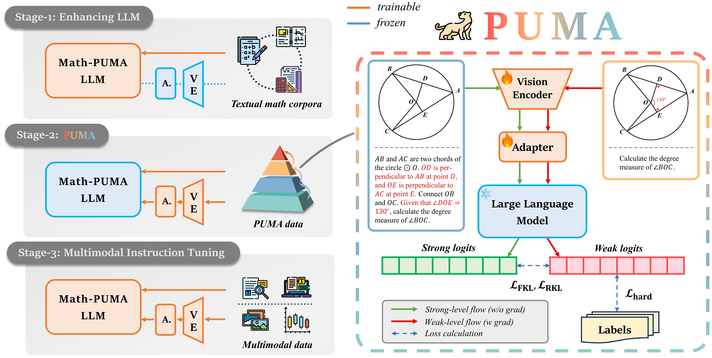

# Math-PUMA: Progressive Upward Multimodal Alignment to Enhance Mathematical Reasoning
 
 

Official repository of "[Math-PUMA: Progressive Upward Multimodal Alignment to Enhance Mathematical Reasoning](https://www.arxiv.org/abs/2408.08640)".

[📖 [Paper](https://www.arxiv.org/abs/2408.08640)] [🤗 [Models](https://huggingface.co/Math-PUMA)] [🤗 [Datasets](https://huggingface.co/Math-PUMA)]


## Install

```bash
conda create -n mathpuma python=3.9 -y
conda activate mathpuma
pip install -r requirements.txt
```

## Model Weights

The model weights for this project are hosted on Hugging Face. 
| Model                 | Download                                                                    |
|-----------------------|-----------------------------------------------------------------------------|
| Math-PUMA_Qwen2VL-1.5B | 🤗 [Hugging Face](https://huggingface.co/Math-PUMA/Math-PUMA_Qwen2VL-1.5B) |
| Math-PUMA_Qwen2VL-7B  | 🤗 [Hugging Face](https://huggingface.co/Math-PUMA/Math-PUMA_Qwen2VL-7B) |
| Math-PUMA_DeepSeek-Math-VL-7B    | 🤗 [Hugging Face](https://huggingface.co/Math-PUMA/Math-PUMA_DeepSeek-Math-VL-7B)   |


## Data for Training

The training data used for this model is also available on Hugging Face. You can find the dataset by visiting [this link](https://huggingface.co/Math-PUMA).

## Train

### Stage 1: Enhancing the Language Model's Mathematical Reasoning Abilities

We leverage the fine-tuning code from two repositories:

- [QwenLM](https://github.com/QwenLM/Qwen)
- [DeepSeek-LLM](https://github.com/deepseek-ai/DeepSeek-LLM)


### Stage 2: Progressive Upward Multimodal Alignment (PUMA)

In `./train/deepseek_math/train_script.py` or `./train/qwen2/train_script.py`:

1. Set `USE_KL` to `"true"`, and set KL hyperparameters `ALPHA_KL`, `LAMBDA_KL`, and `TEMP_KL`.

2. Set `TRAINABLE_PARTS` to `"aligner, vision_tower_low, vision_tower_high"`.

3. Set `DATA_PATH`, it is worth noting that the data files must contain keys `image_url_2`, `instruction_2`, and `output_2`.

4. Run `./train/deepseek_math/train_script.py` or `./train/qwen2/train_script.py`.

### Stage 3: Multimodal Instruction Tuning

In `./train/deepseek_math/train_script.py` or `./train/qwen2/train_script.py`:

1. Set `USE_KL` to `"false"`.

2. Set `TRAINABLE_PARTS` to `"all"`.

3. Set `DATA_PATH`.

4. Run `./train/deepseek_math/train_script.py` or `./train/qwen2/train_script.py`.

## Evaluate

Download images of [MathVerse](https://huggingface.co/datasets/AI4Math/MathVerse/resolve/main/images.zip?download=true), [MathVista](https://huggingface.co/datasets/AI4Math/MathVista/resolve/main/images.zip?download=true), and [We-Math](https://huggingface.co/datasets/We-Math/We-Math/resolve/main/testmini.zip?download=true), and put them into `./eval/data/<benchmark>/images`.

In `./eval/evaluate/benchmark.py`:

1. Set `benchmark` to one of `["mathverse", "mathvista", "wemath"]`.

2. To evaluate `DeepSeek-Math` based MLLM, set `model_type` to `deepseek-vl`, `is_customvlm` to `"false"`, and provide `model_path`; to evaluate `Qwen2` based MLLM or other customized MLLMs, set `is_customvlm` to `"true"`, and provide `model_path`.

3. Run `./eval/evaluate/benchmark.py`.

## Citation

If you find **Math-PUMA** useful for your research and applications, please kindly cite using this BibTeX:

```bibtex
@article{zhuang2024math,
  title={Math-PUMA: Progressive Upward Multimodal Alignment to Enhance Mathematical Reasoning},
  author={Zhuang, Wenwen and Huang, Xin and Zhang, Xiantao and Zeng, Jin},
  journal={arXiv preprint arXiv:2408.08640},
  year={2024}
}
```
